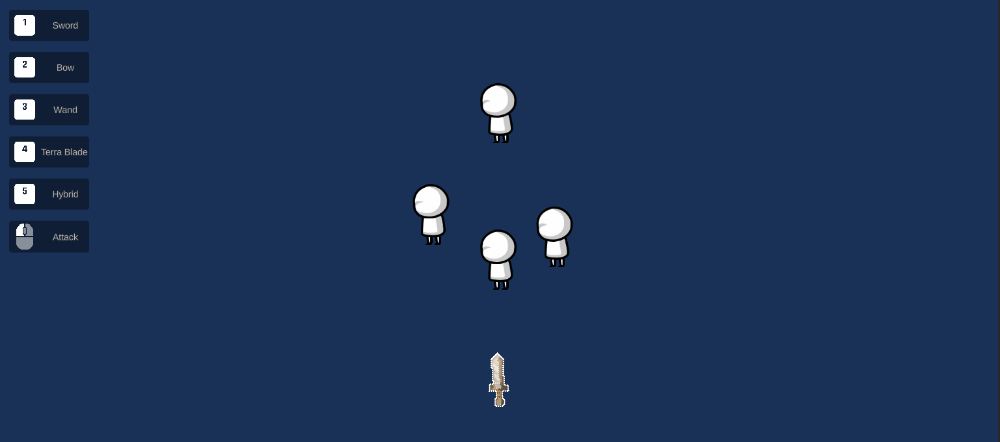

# ⚔ Modular Weapon System (Unity 2D)

A flexible and extensible 2D weapon system built in Unity, designed around `ScriptableObject`s and modular components. This project demonstrates how to separate weapon logic, animation, visuals, and behavior using a clean, data-driven architecture.

> ⚙️ Built for learning, reusability, and portfolio purposes.

---

## 📌 Key Features

- ✅ **Modular architecture** – weapons are assembled from interchangeable components
- ✅ **ScriptableObject-based design** – all logic is data-driven, easily editable in the Inspector
- ✅ **Custom attack behaviors** – each module defines its own firing logic and effect
- ✅ **Flexible animation system** – attack animations built using DOTween `Sequence`
- ✅ **Easy extension** – new weapons and modules can be added without writing new code
- ✅ **Shared module context** – modules can influence each other during attack execution

---

## 🎮 Mechanics Overview

In this system, a weapon is composed of **modular components**, each responsible for a specific behavior, such as:

- Spawning a projectile
- Modifying damage
- Playing an animation
- Triggering effects (e.g., explosion)

Each weapon is defined by a `WeaponData` ScriptableObject, which includes:

- A list of `WeaponModule` components
- A reference to a `WeaponAnimation` (also a ScriptableObject)
- A sprite for visuals
- Common parameters like base damage, size of the weapon's hitbox, etc.

---

## 🔧 ModuleContext

To allow communication and value modification between modules, the system uses a `ModuleContext` — a dynamic key-value store.

It allows modules to:

- Read and write shared data during an attack (e.g., `"damage"`, `"explosionRadius"`)
- Override or augment weapon properties without direct references
- Maintain flexibility and reusability between modules

Modules only use keys they care about, making the system extensible without tight coupling.

🧩 Built-in Modules

🔹 Arrow Module
Spawns a projectile prefab (e.g., arrow) on each animation cycle. Simple, fast, and reliable.

🔹 Fireball Module
Spawns a fireball prefab, but only once every 2 seconds. Useful for slow or powerful attacks.

🔹 Explosion Module
Can be added to any projectile. Triggers an area-of-effect explosion when the projectile hits an enemy.

🔹 Beam Module
Inspired by Terra Blade from Terraria. Launches a forward-flying energy wave that pierces up to 10 enemies. Functionally similar to Arrow Module but with pierceCount = 10.

🔹 Random Damage Module
Modifies the "damage" value in the context by multiplying it with a random number between minMultiplier and maxMultiplier.

🧪 Demo Weapons
1. 🗡️ Sword
- Uses two randomizer modules with different parameters.
- Plays a simple animation.
- Each hit deals randomized damage.

2. 🏹 Bow
- Combines a randomizer and arrow module.
- Spawns an arrow on attack.
- Basic projectile-based ranged weapon.

3. 🔥 Wand
- Spawns a fireball, which contains an embedded explosion module.
- Deals area damage on hit.
- Good for crowd control.

4. 🌈 Terra Blade (Inspired by Terraria)
- Hybrid weapon: designed for both melee and ranged.
- Launches a beam that pierces enemies (melee is not shown in demo scene).
- Effective at line damage.

5. 🌀 Hybrid Combo
- Combines arrows, fireballs, and beam modules.
- Uses multiple randomizers.
- A powerful test weapon that shows full modular potential.

🛠 Tech Stack
- Unity 2021.3.24f1
- C# (Unity API)
- DOTween (for sequence-based animations)
- ScriptableObject-driven design
- Modular programming architecture

📸 Demo & Screenshots
🖼️ 
🕹️ Try the WebGL [Demo](https://ivanafanasiev.github.io/Modular-Weapon-System/docs/)

🧩 Future Ideas (Optional Section)
- Modular charge system (e.g., hold to charge)
- Sound effects per module (draw, shoot, impact)
- Combo chains (modules triggering other modules)
